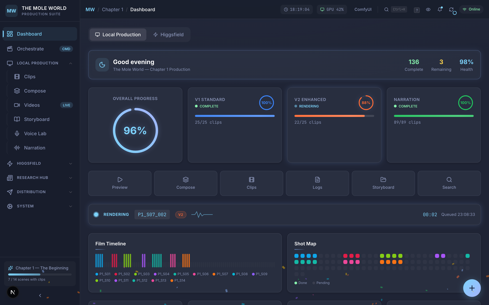
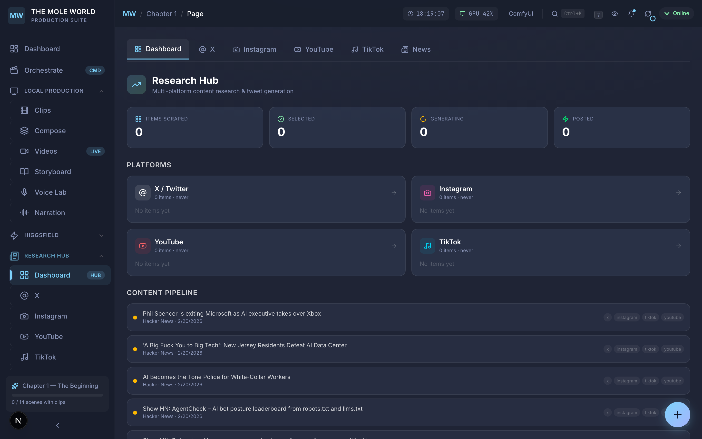
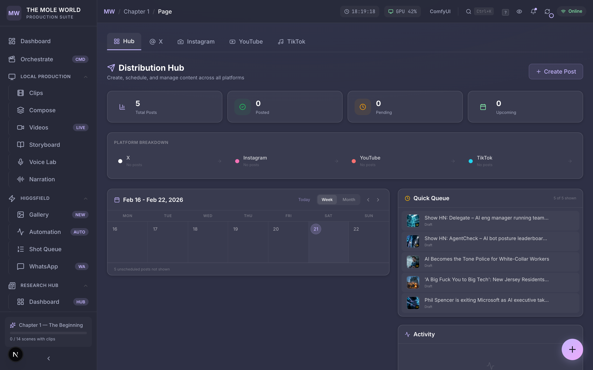
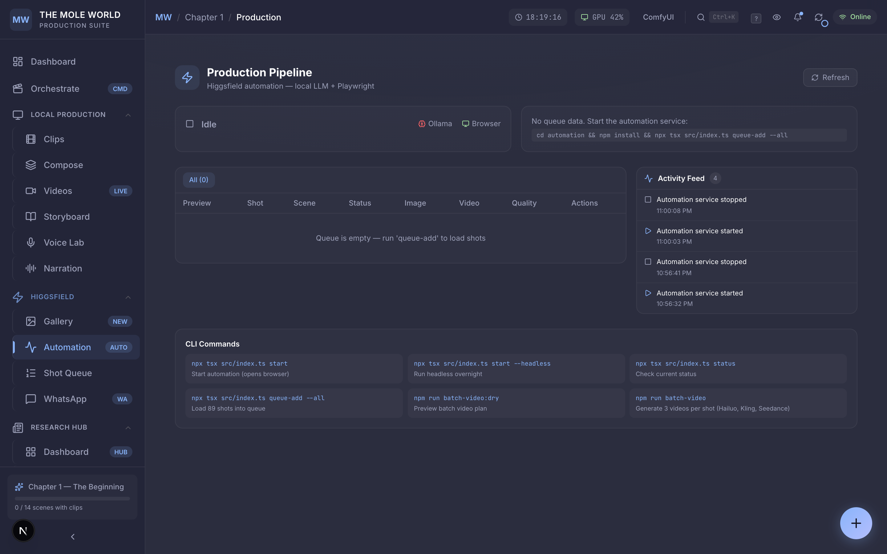
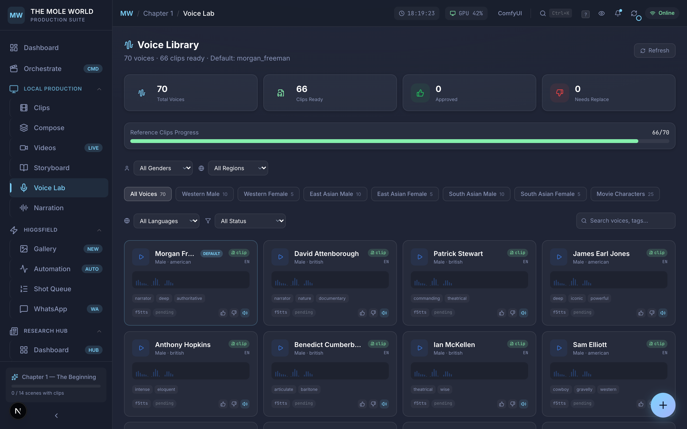
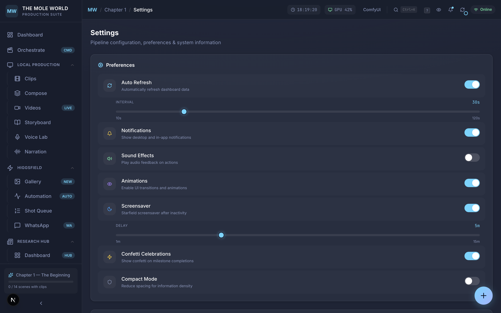
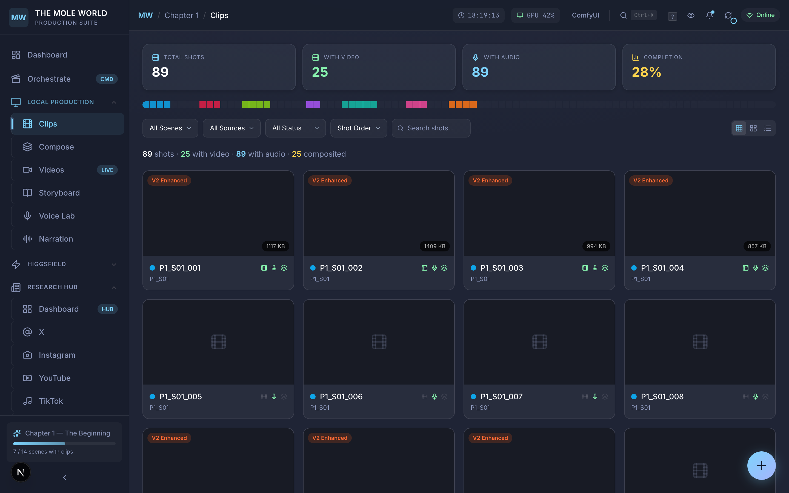
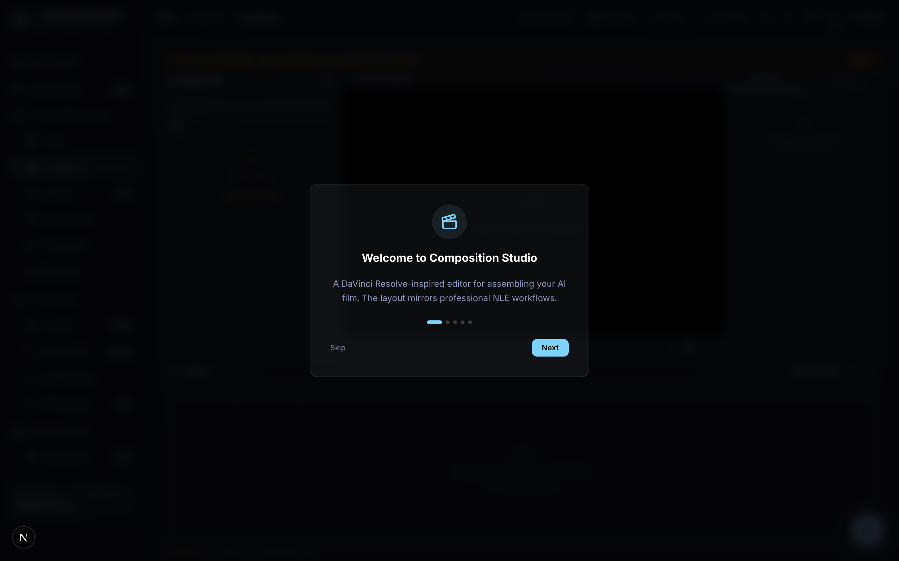
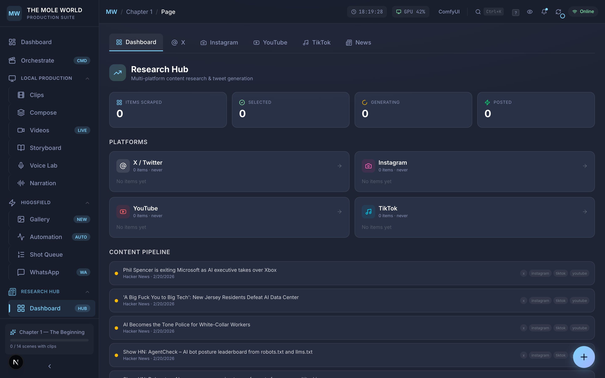

# The Mole World — AI Film Production Dashboard

> Real-time production control center for an AI-generated animated short film. Every frame rendered by a 14B parameter video model on a single RTX 4090. Built solo, zero budget.

**[Live Demo](https://aptsalt.github.io/mole-world-dashboard/)** | **[Source](https://github.com/aptsalt/mole-world-dashboard)**

---

## Screenshots

| Dashboard (Cool Navy) | Research Hub | Distribution (Soft Charcoal) |
|:---:|:---:|:---:|
|  |  |  |

| Production (Warm Slate) | Voice Lab | Settings |
|:---:|:---:|:---:|
|  |  |  |

| Clips Browser | Composition Editor | Content Pipeline |
|:---:|:---:|:---:|
|  |  |  |

---

## The Film

**The Mole World** is a philosophical sci-fi animated short about a subterranean dystopia where every human is implanted and owned. When Anaya's implant glitches, she begins to see the world for what it really is.

- **Chapter 1:** 14 scenes, 89 shots, 25 sequential clips, 6 characters
- **Runtime:** ~11 minutes of generated footage
- **Every frame** is AI-generated — no stock footage, no manual animation

| Phase | Progress |
|---|---|
| V1 Standard | 25/25 (100%) |
| V2 Enhanced | 22/25 (88%) |
| Narration | 89/89 (100%) |
| Compositing | 25/25 (100%) |

---

## Multi-Theme System

Four color themes with WCAG AA-compliant contrast ratios (~6:1 for muted text):

| Theme | Background | Accent | Muted Text Contrast |
|---|---|---|---|
| **Cool Navy** (default) | `#1f2435` | `#7dd3fc` | ~6.2:1 |
| **Warm Slate** | `#2b2d3e` | `#89b4fa` | ~5.8:1 |
| **Soft Charcoal** | `#2e3045` | `#c4b5fd` | ~5.8:1 |
| **Light Mode** | `#f8fafc` | `#0284c7` | ~7.0:1 |

Implemented via CSS custom properties with `[data-theme]` attribute overrides and a route-aware `ThemeProvider`. All colors use `var()` references — zero hardcoded hex values in components. SSE (Server-Sent Events) provides real-time updates for automation status, queue changes, and narration progress.

---

## Features

### 20 Purpose-Built Pages

| Page | Route | Description |
|---|---|---|
| **Dashboard** | `/` | 20+ widgets: progress rings, pipeline health, GPU stats, render heatmap, film timeline, shot map |
| **Clips** | `/clips` | 89-shot gallery with Grid/Mosaic/List views, V1/V2 comparison slider, cinema modal, mini player |
| **Videos** | `/videos` | Multi-model video tracker (Hailuo, Seedance, Kling) |
| **Compose** | `/compose` | Timeline editor with render presets, crossfade, narration toggle, title card |
| **Storyboard** | `/storyboard` | Full screenplay: 14 scenes, character profiles, expandable shot details |
| **Voice Lab** | `/voices` | 7 voice profiles, waveform previews, 89 assignments, quality grading |
| **Narration** | `/narration` | TTS narration management and script editor |
| **Pitch** | `/pitch` | Development journey presentation |
| **Production** | `/production` | Automation control panel with CLI commands and activity feed |
| **Gallery** | `/gallery` | Video gallery browser |
| **Queue** | `/queue` | Shot queue editor with prompt editing and bulk ops |
| **WhatsApp** | `/whatsapp` | WhatsApp bot pipeline with job cards and media previews |
| **Content** | `/content` | News-to-social pipeline: AI curation, generation, scheduling |
| **Research Hub** | `/research` | Multi-platform research (X, Instagram, YouTube, TikTok, RSS) with content ranking |
| **Distribution** | `/distribution` | Social posting hub with calendar, queue, per-platform pages |
| **Orchestrate** | `/orchestrate` | AI pipeline control (Ollama-powered) |
| **Analytics** | `/analytics` | Cross-pipeline analytics — platform distribution, model performance, voice usage, posting timeline |
| **Settings** | `/settings` | Theme selection (4 themes), refresh interval, API health checks, thumbnail cache |
| **Logs** | `/logs` | Pipeline log viewer with search and color-coded entries |

### Key Highlights

- **WCAG AA Contrast** — all text meets 4.5:1 minimum contrast ratio across all 4 themes
- **SSE Real-Time Updates** — Server-Sent Events for live automation status, queue changes, and narration progress
- **V1/V2 Comparison Slider** — synchronized dual-video playback with drag-to-compare using CSS `clip-path: inset()`
- **Mini Player** — persistent bottom-bar across all pages with playlist navigation, click-to-seek, built on Zustand
- **Research Hub** — scrape trending content from X, Instagram, YouTube, TikTok; Ollama ranks by relevance/virality; one-click tweet composer
- **Distribution Hub** — unified social media posting with calendar view, post queue, per-platform analytics
- **Guided Onboarding** — interactive walkthrough for first-time users
- **Command Palette** (`Ctrl+K`) — fuzzy search across pages and actions
- **Keyboard Shortcuts** (`?` to view) — full keyboard navigation
- **Floating Action Button** — radial menu with 8 quick actions
- **Screensaver** — starfield animation after idle timeout (theme-aware)
- **60+ Custom Animations** — shimmer bars, pulse indicators, glass breathing, staggered reveals, waveform bars

---

## Tech Stack

| Layer | Technology |
|---|---|
| Framework | Next.js 16.1 (App Router + Turbopack) |
| Language | TypeScript 5.9 (strict, zero `any`) |
| Styling | Tailwind CSS v4 + CSS custom properties |
| State | Zustand |
| Charts | Recharts |
| Animation | Framer Motion + CSS keyframes |
| Icons | Lucide React |
| Video AI | WanVideo 2.1 (14B) via ComfyUI |
| TTS | F5-TTS with voice cloning (7 profiles) |
| GPU | NVIDIA RTX 4090 (16GB VRAM) |

---

## Getting Started

### Demo Mode (no backend needed)

```bash
git clone https://github.com/aptsalt/mole-world-dashboard.git
cd mole-world-dashboard
npm install
npm run dev
```

Open [http://localhost:3003](http://localhost:3003). The dashboard loads pre-captured production data from `data/demo-*.json` automatically.

### What's Included

This public repo contains the complete dashboard frontend. All API routes return demo data — no backend services required. Video playback and write operations (posting, generating) are disabled in demo mode.

The full production pipeline (video generation, TTS, browser automation, social posting) lives in the private repo.

---

## Project Structure

```
mole-world-dashboard/
├── data/                    # Demo JSON snapshots (16 files)
│   ├── demo-status.json     # Pipeline progress
│   ├── demo-stats.json      # Render metrics
│   ├── demo-clips.json      # 89 clips with metadata
│   ├── demo-storyboard.json # Screenplay (14 scenes, 89 shots)
│   ├── demo-voices.json     # Voice assignments & profiles
│   ├── demo-videos.json     # Multi-model video entries
│   ├── demo-queue.json      # Render queue items
│   ├── demo-content-*.json  # Content pipeline data
│   ├── demo-research-*.json # Research feeds (X, IG, YT, TikTok)
│   └── demo-whatsapp-*.json # WhatsApp job data
├── screenshots/             # App screenshots
├── src/
│   ├── app/                 # 18 page routes + API routes
│   │   ├── globals.css      # Multi-theme system + 800+ lines animations
│   │   └── ...
│   ├── components/
│   │   ├── layout/          # AppShell, Sidebar, Topbar, ThemeProvider
│   │   ├── research/        # ResearchItemCard, PlatformPage, TweetComposer
│   │   ├── distribution/    # PostCard, Calendar, PlatformPage, Composer
│   │   ├── content/         # NewsCard, ContentEditor, PostQueueCard
│   │   └── ui/              # MiniPlayer, CommandPalette, FAB, Toast, etc.
│   └── lib/
│       ├── api.ts           # Dual-mode data fetching (demo/live)
│       ├── types.ts         # Full TypeScript interface system
│       ├── store.ts         # Zustand global state
│       └── utils.ts         # Formatting & color utilities
├── package.json
├── next.config.ts
└── tsconfig.json
```

---

## Pipeline Architecture

```
Screenplay → Storyboard JSON → Per-Shot Prompt Assembly
                                        ↓
                              ComfyUI + WanVideo 2.1 (14B)
                              ~35 min/clip, 16GB VRAM
                                        ↓
                              V1 (rapid 480p) → V2 (quality 720p)
                                        ↓
                              F5-TTS Voice Synthesis
                              7 voice profiles, 89 narrations
                                        ↓
                              FFmpeg Compositing
                              Crossfade + narration overlay
                                        ↓
                              This Dashboard
                              Real-time monitoring, quality grading, distribution
```

---

## Key Metrics

| Metric | Value |
|---|---|
| Total renders | 46 clips |
| Total GPU time | 27.5 hours |
| Average per clip | 35.8 minutes |
| Voice profiles | 7 tested, 2 selected |
| Audio narrations | 89 clips (76.6 MB) |
| Custom animations | 60+ keyframes |
| Dashboard pages | 20 |
| Color themes | 4 (WCAG AA compliant) |
| TypeScript strict | Zero `any` types |

---

## Built Entirely with Claude Code

This entire project — dashboard, automation pipeline, WhatsApp bridge, TTS engine, distribution system — was built by one person pair-programming with [Claude Code](https://claude.ai/code) (Anthropic's CLI coding agent). Zero lines of hand-written code. Every file was authored, debugged, and iterated through Claude Code sessions.

### Usage Stats (Feb 5–22, 2026)

| Metric | Value |
|---|---|
| **Total sessions** | 216+ |
| **Total messages exchanged** | 200,000+ |
| **Tokens processed** | 3.76 billion |
| **API-equivalent cost** | ~$8,267 (on $200/mo Pro plan — **41x leverage**) |
| **Tool invocations** | 10,000+ (file edits, bash commands, grep, web search) |
| **Longest single session** | 947 messages, ~13 hours, 182 MB of agent output |
| **Peak day** | Feb 21 — 22,072 messages across 17 sessions |
| **Models used** | Claude Opus 4.6 (primary), Sonnet 4 (subagents) |

### How It Works

Every feature starts as a natural-language plan. Claude Code decomposes it into tasks, reads the codebase, writes the implementation, runs tests, debugs failures, and iterates — all in one session. The human role: architecture decisions, product direction, live testing, and course-correcting when things break.

Example: The [Production House Pipeline session](#session-1--production-house-pipeline) built 10 major systems (F5-TTS engine, 70-voice library, YouTube downloader, audio mixer, multi-segment video composition, WhatsApp command interface) in 5 hours with 541 tool invocations and zero hand-written code.

---

## Coding Agent Sessions

Raw Claude Code session transcripts from building this project. Each shows the full human ↔ agent conversation: architecture decisions, implementation, live debugging, and iteration.

### Session 1 — Production House Pipeline
**Duration:** 5 hours | **Messages:** 594 | **Tool calls:** 541 | **Context resets:** 4

Built in one session: F5-TTS engine with Apple Silicon MPS acceleration, 70-voice celebrity library (Morgan Freeman, Irrfan Khan, David Attenborough, etc.), YouTube reference clip downloader, FFmpeg audio mixer, text overlay system, multi-segment lesson pipeline (6×5s shots → 30s narrated videos), model alias system for 15+ free AI models, WhatsApp bridge with typo-tolerant parsing, and a dashboard voice review UI. End-to-end: WhatsApp message → narrated AI video delivered back, fully automated.

### Session 2 — WhatsApp Pipeline (Mac Mini 24/7)
**Duration:** 2.5 hours | **Messages:** 453 | **Tool calls:** 437 | **Context resets:** 3

Adapted a Windows Playwright automation pipeline to macOS, bridged it to WhatsApp via OpenClaw gateway, and configured it to run 24/7 on a Mac Mini. The session includes live debugging with the user testing from their phone — discovering the wrong WhatsApp group JID, fixing allowlist configuration, and a full architectural pivot when the LLM agent refused to use image generation tools (building a standalone WebSocket bridge to bypass it).

### Session 3 — Full Dashboard Build (Monster Session)
**Duration:** ~13 hours | **Messages:** 947 | **File size:** 182 MB

Built the complete production dashboard in a single session: V1/V2 clip comparison with synchronized playback and drag slider, film composer with timeline editor, real-time pipeline status, media API, mini player, voice lab, storyboard viewer, and 20 pages. Full stack: Next.js + Zustand + Recharts + Framer Motion.

### Session 4 — Higgsfield Automation Pipeline
**Duration:** ~4 hours | **Tool calls:** 7-phase autonomous build

End-to-end browser automation that controls Higgsfield.ai (video generation platform with no API) via Playwright + local Ollama LLM (Qwen 14B). Automates 89 shots of the animated film from prompt generation to video download. The agent self-managed a 7-task backlog — scaffolding, queue system, Ollama integration, browser profiles, output processing, dashboard integration, and state management.

### Download Session Transcripts

| File | Size | Contents |
|---|---|---|
| [`mole-world-higgsfield-automation-session.zip`](sessions/mole-world-higgsfield-automation-session.zip) | 1.6 MB | Higgsfield pipeline build — browser automation, queue system, Ollama LLM integration |
| [`mole-world-full-dashboard-session.zip`](sessions/mole-world-full-dashboard-session.zip) | 9.4 MB | Full dashboard build — 20 pages, 120+ components, 13-hour session |
| [`yc_claude_sessions.zip`](sessions/yc_claude_sessions.zip) | 20 KB | Production House + WhatsApp Pipeline transcripts (formatted markdown) |

---

## Built By

**Deep Chand** — Solo founder & engineer. The entire AI film production pipeline — screenplay, video generation, voice synthesis, compositing, WhatsApp automation, and this dashboard — designed, directed, and built by one person on consumer hardware with zero budget, pair-programming exclusively with Claude Code.

---

## License

MIT
