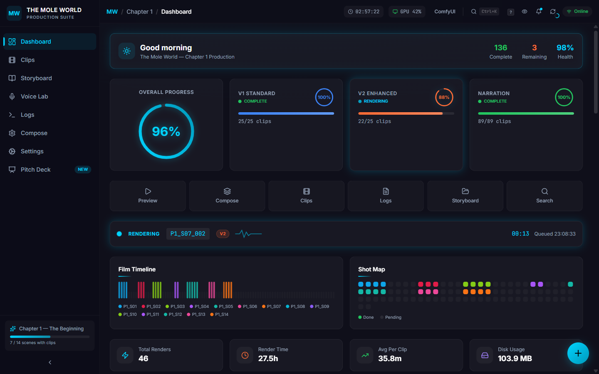
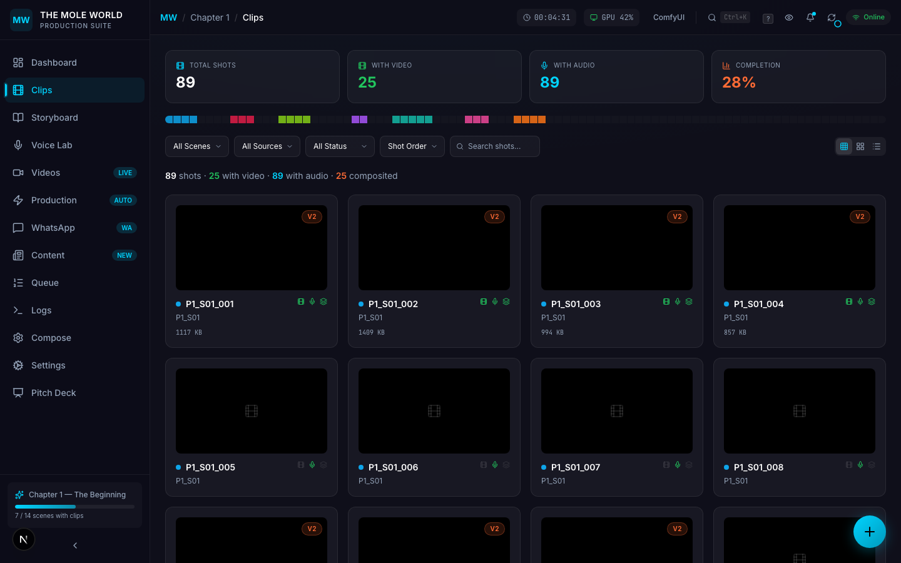
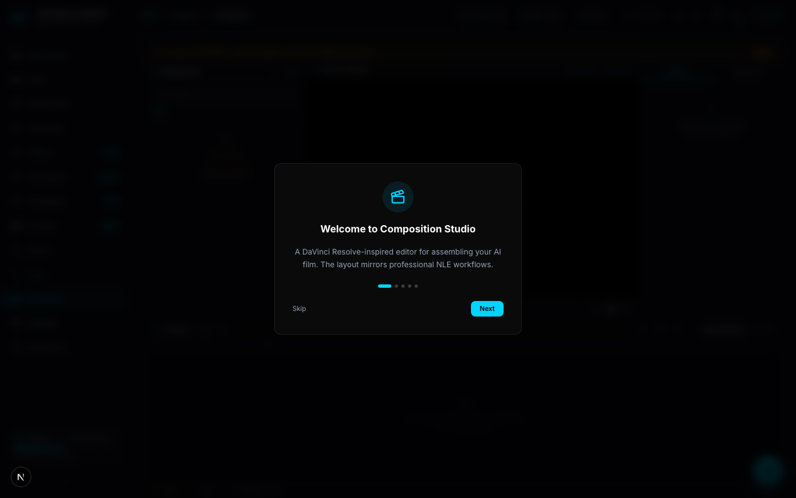
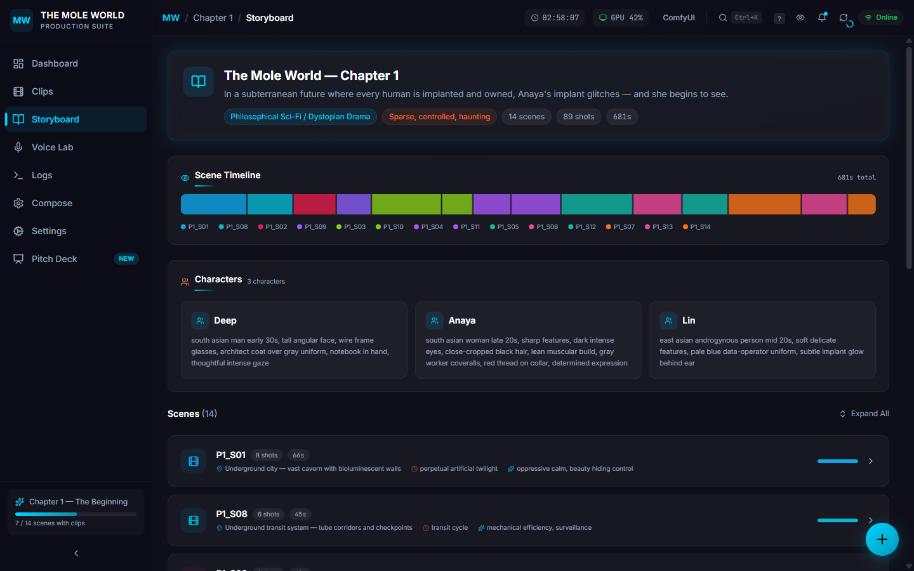
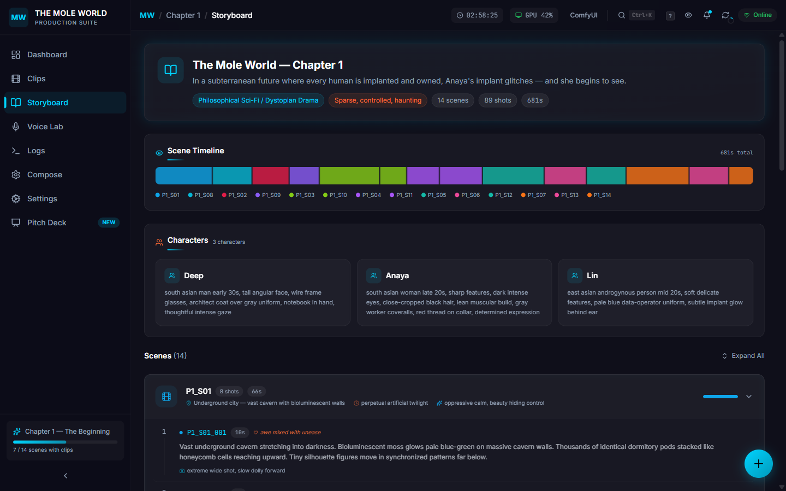
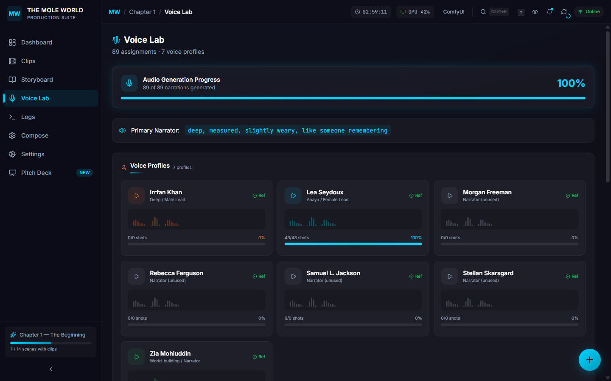
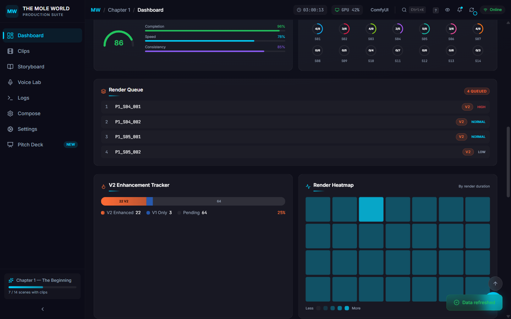

# The Mole World — AI Film Production Dashboard

> Real-time production control center for an AI-generated animated short film. Every frame rendered by a 14B parameter video model on a single RTX 4090. Built solo, zero budget.

**[Live Demo](https://aptsalt.github.io/mole-world-dashboard/)** | **[GitHub](https://github.com/aptsalt/mole-world-dashboard)**



---

## The Film

**The Mole World** is a philosophical sci-fi animated short about a subterranian dystopia where every human is implanted and owned. When Anaya's implant glitches, she begins to see the world for what it really is.

- **Genre:** Philosophical Sci-Fi / Dystopian Drama
- **Chapter 1:** 14 scenes, 89 shots, 25 sequential clips, 6 characters
- **Runtime:** ~11 minutes of generated footage
- **Every frame** is AI-generated — no stock footage, no manual animation

### Current Production Status

| Phase | Progress | Details |
|-------|----------|---------|
| V1 Standard | 25/25 (100%) | Rapid prototyping pass — all clips rendered |
| V2 Enhanced | 22/25 (88%) | Production quality pass — in progress |
| Narration | 89/89 (100%) | All voice narrations generated |
| Compositing | 25/25 (100%) | All V1 clips stitched with narration |

---

## What Makes This Dashboard Unique

This isn't a generic admin panel. Every component was purpose-built for the specific problem of orchestrating an AI film pipeline on consumer hardware.

### V1/V2 Comparison Slider with Synchronized Playback

The comparison slider lets you drag between V1 (rapid prototype) and V2 (enhanced) renders of the same shot in real-time. Both videos play in sync — pause one, both pause. The slider uses CSS `clip-path: inset()` for pixel-perfect clipping and `setPointerCapture` for smooth drag behavior.

This was essential for judging whether a V2 re-render actually improved on V1, since each render costs ~35 minutes of GPU time.

### Clip Gallery with Shot Drawer & Mini Player



The clip gallery supports three view modes (Grid, Mosaic, List) with filtering by scene, source version, and completion status. Clicking any clip opens a **shot drawer** on the right showing:

- Storyboard metadata (camera angle, emotion, action description)
- File size and source version (V1/V2)
- Scene and composition status
- Quick actions: Play in Mini Player, Compare V1/V2

The **mini player** persists at the bottom of the screen across page navigation. It supports:

- Auto-play with muted-by-default (respects browser autoplay policy)
- Playlist navigation — skip through filtered clips
- Click-to-seek progress bar
- Error state handling (network failures, unsupported formats)
- Built on Zustand for HMR-safe state that survives hot reloads

### Film Composer with Timeline Editor



The compose page provides a visual timeline of all 89 shots organized by scene, with render presets (Preview 480p, Standard 720p, High Quality 1080p), crossfade duration control, narration toggle, and color grading options. A title card preview renders in real-time showing the film credits.

The **composition readiness** checklist shows at a glance whether all clips are rendered, storyboard is loaded, and presets are configured before triggering a compose job.

### Storyboard Viewer with Full Screenplay



The storyboard page renders the complete screenplay structure:

- **Film info header** with genre, tone, logline, and total runtime
- **Scene timeline** — proportional duration bars for all 14 scenes
- **Character profiles** with visual descriptions used as AI prompts
- **Expandable scene accordions** — each shot shows its action description, camera angle, emotion tag, character list, and duration



### Voice Lab with Narrator Profiles



The Voice Lab manages 7 voice profiles (Irrfan Khan, Lea Seydoux, Morgan Freeman, Rebecca Ferguson, Samuel L. Jackson, Stellan Skarsgard, Zia Mohiuddin) with:

- Animated waveform previews for each profile
- Reference audio sample playback
- Per-shot voice assignment table (89 assignments)
- Scene-by-scene audio coverage donuts
- Audio generation progress tracker (100% complete)

### Production Analytics Dashboard



The main dashboard packs 20+ purpose-built widgets:

- **96% progress ring** — animated SVG with gradient stroke
- **Pipeline health gauge** — composite score from completion, speed, consistency
- **Scene breakdown donuts** — per-scene clip completion (S01: 4/8, S02: 3/6, etc.)
- **Render heatmap** — 28-cell grid showing render duration intensity per clip
- **V2 enhancement tracker** — stacked progress bar (22 V2 / 3 V1-only / 64 pending)
- **Render performance chart** — Recharts bar chart comparing V1 vs V2 render times
- **GPU stats widget** — VRAM usage, utilization, temperature, power draw
- **Render queue** — priority-sorted upcoming jobs
- **Activity feed** — color-coded live log entries from the pipeline
- **Production milestones timeline** — visual progress markers
- **Currently rendering indicator** — heartbeat animation with live timer and queue time

### UI/UX Polish

- **Glass-morphism dark theme** — `#0f0f1a` deep navy background, `#00d4ff` electric cyan accent, `blur(16px)` frosted glass cards
- **Command palette** (`Ctrl+K`) — fuzzy search across all pages and actions
- **Keyboard shortcuts** (`?` to view) — full keyboard navigation
- **Floating action button** — radial menu with 8 quick actions
- **Toast notifications** — unobtrusive status updates via Zustand store
- **Screensaver mode** — activates after idle timeout with parallax animation
- **Confetti celebrations** — milestone completion feedback
- **60+ custom CSS animations** — shimmer progress bars, pulse indicators, heartbeat rendering, glass breathing, staggered grid reveals, waveform bars

---

## Architecture

```
┌─────────────────────────────────────────────────────────────────┐
│                     Next.js 16 Frontend                         │
│         TypeScript (strict) + Tailwind v4 + Zustand             │
│         Recharts + Framer Motion + Lucide Icons                 │
├─────────────────────┬───────────────────────────────────────────┤
│    Demo Mode        │              Live Mode                    │
│    Static JSON      │         Flask API (:5555)                 │
│  (GitHub Pages)     │    + Video Streaming API Route            │
│                     │    (HTTP Range Requests / 206)            │
├─────────────────────┴───────────────────────────────────────────┤
│                    Film Pipeline Backend                         │
│              Python + ComfyUI + WanVideo 2.1                    │
├─────────────────────────────────────────────────────────────────┤
│                    NVIDIA RTX 4090                               │
│              16GB VRAM · CUDA 12.x · ~35 min/clip               │
└─────────────────────────────────────────────────────────────────┘
```

### Dual-Mode Data Layer

The dashboard runs in two modes with a single codebase:

- **Demo Mode** (GitHub Pages): Loads pre-captured JSON snapshots from `/data/demo-*.json`. No backend required. Deployed via GitHub Actions with static export.
- **Live Mode** (localhost): Connects to Flask backend at `:5555` for real-time pipeline monitoring. Video streaming via a Next.js API route (`/api/media/[...path]`) that serves files from the local output directory with HTTP range request support for seeking.

```typescript
// api.ts — transparent mode switching
const isDemo = process.env.NEXT_PUBLIC_DEMO_MODE === 'true';
const data = isDemo ? await fetch('/data/demo-clips.json') : await fetch(`${apiUrl}/api/clips`);
```

---

## The Pipeline: ComfyUI → WAN → TTS → Compose

This is the engineering behind generating every frame and voice of the film on a single consumer GPU.

```
┌──────────────────────────────────────────────────────────────────────────────┐
│                        FILM PIPELINE ARCHITECTURE                            │
│                                                                              │
│  ┌─────────────┐    ┌──────────────────┐    ┌─────────────────────────────┐  │
│  │  SCREENPLAY  │───▶│  STORYBOARD JSON  │───▶│  PER-SHOT PROMPT ASSEMBLY   │  │
│  │  (14 scenes) │    │  (89 shots with   │    │                             │  │
│  │              │    │   camera, action,  │    │  style_prompt (global)      │  │
│  │              │    │   emotion, chars)  │    │  + character visual_prompt  │  │
│  │              │    │                    │    │  + shot action text         │  │
│  └─────────────┘    └──────────────────┘    │  + camera direction          │  │
│                                              │  + negative prompt           │  │
│                                              └──────────┬──────────────────┘  │
│                                                         │                     │
│                                                         ▼                     │
│  ┌──────────────────────────────────────────────────────────────────────────┐ │
│  │                         ComfyUI (localhost:8188)                         │ │
│  │                                                                          │ │
│  │  ┌──────────────┐     ┌──────────────┐     ┌────────────────────────┐   │ │
│  │  │  Text Encoder │────▶│  WanVideo 2.1 │────▶│  Video Decoder + Save  │   │ │
│  │  │  (CLIP)       │     │  14B params   │     │  MP4 @ 480p/720p       │   │ │
│  │  └──────────────┘     │  ~35 min/clip │     └────────────────────────┘   │ │
│  │                        │  16GB VRAM    │                                  │ │
│  │                        └──────────────┘                                  │ │
│  │                                                                          │ │
│  │  GPU Management:                                                         │ │
│  │  • Full VRAM allocation (14.8GB/16GB for 14B model)                     │ │
│  │  • Sequential rendering — one clip at a time                            │ │
│  │  • Seed tracking per clip for reproducibility                            │ │
│  │  • WebSocket queue monitoring via ComfyUI API                           │ │
│  └──────────────────────────────────────────────────────────────────────────┘ │
│                              │                                                │
│                              ▼                                                │
│  ┌──────────────────────────────────────────────────────────────────────────┐ │
│  │                           V1 → V2 STRATEGY                               │ │
│  │                                                                          │ │
│  │  V1 Standard (rapid):   480p, default params, ~37 min/clip, avg 314 KB  │ │
│  │  V2 Enhanced (quality): 720p, tuned params, ~35 min/clip, avg 913 KB    │ │
│  │                                                                          │ │
│  │  Why two passes?                                                         │ │
│  │  • V1 validates the storyboard — are prompts producing the right shots? │ │
│  │  • V2 refines only the shots that V1 proved work                        │ │
│  │  • Comparison slider in dashboard lets you A/B test before committing   │ │
│  │  • Total GPU time: 27.5 hours across 46 renders                        │ │
│  └──────────────────────────────────────────────────────────────────────────┘ │
│                              │                                                │
│                              ▼                                                │
│  ┌──────────────────────────────────────────────────────────────────────────┐ │
│  │                        TTS VOICE SYNTHESIS                               │ │
│  │                                                                          │ │
│  │  Engine: F5-TTS (local) with voice cloning from reference samples       │ │
│  │                                                                          │ │
│  │  Voice Strategy:                                                         │ │
│  │  • 7 voice profiles cloned from reference audio samples                 │ │
│  │  • Character-driven assignment (Anaya → Lea Seydoux voice clone)        │ │
│  │  • World-building narration → Zia Mohiuddin voice clone                 │ │
│  │  • Narrator tone: "deep, measured, slightly weary, like someone         │ │
│  │    remembering"                                                          │ │
│  │  • Per-shot assignment table (89 entries) in storyboard JSON            │ │
│  │  • Total audio: 76.6 MB across 89 narration clips (avg 882 KB each)    │ │
│  │                                                                          │ │
│  │  Experiments we ran:                                                      │ │
│  │  • Morgan Freeman, Samuel L. Jackson, Rebecca Ferguson, Stellan          │ │
│  │    Skarsgard — tested but reserved for future chapters                   │ │
│  │  • Settled on Lea Seydoux (43 shots) + Zia Mohiuddin (46 shots)         │ │
│  │    for the intimacy vs. scale duality of the story                       │ │
│  └──────────────────────────────────────────────────────────────────────────┘ │
│                              │                                                │
│                              ▼                                                │
│  ┌──────────────────────────────────────────────────────────────────────────┐ │
│  │                         COMPOSITING                                      │ │
│  │                                                                          │ │
│  │  Video + Audio → FFmpeg merge with:                                      │ │
│  │  • Configurable crossfade transitions (0-2s)                            │ │
│  │  • Narration overlay synced to shot duration                            │ │
│  │  • Color grading pass (optional)                                        │ │
│  │  • Title card generation                                                │ │
│  │  • Output: chapter1_composed.mp4                                        │ │
│  └──────────────────────────────────────────────────────────────────────────┘ │
│                                                                              │
│  ┌──────────────────────────────────────────────────────────────────────────┐ │
│  │                      MONITORING (This Dashboard)                         │ │
│  │                                                                          │ │
│  │  Flask API (:5555) exposes:                                              │ │
│  │  • /api/status — phase progress, currently rendering, queue             │ │
│  │  • /api/stats  — render times, file sizes, GPU metrics                  │ │
│  │  • /api/clips  — all 89 clips with paths, metadata, versions           │ │
│  │  • /api/storyboard — full screenplay JSON                               │ │
│  │  • /api/voices — voice assignments and profiles                         │ │
│  │  • /api/logs   — pipeline log files and recent entries                  │ │
│  │                                                                          │ │
│  │  Dashboard polls every 30s for live updates                              │ │
│  │  Video streaming: Next.js API route with HTTP 206 range requests        │ │
│  └──────────────────────────────────────────────────────────────────────────┘ │
└──────────────────────────────────────────────────────────────────────────────┘
```

### GPU Management on Consumer Hardware

Running a 14B parameter video model on 16GB VRAM required careful resource management:

| Challenge | Solution |
|-----------|----------|
| **VRAM saturation** | WanVideo 2.1 consumes ~14.8GB of 16GB. No room for concurrent jobs. Sequential rendering only. |
| **35-minute render cycles** | Automated queue system with priority levels (high/normal/low). Dashboard shows live timer + queue position. |
| **Reproducibility** | Every render logs its seed number. Re-rendering with the same seed produces identical output. |
| **V1/V2 comparison** | Two-pass strategy: V1 validates prompts cheaply, V2 enhances confirmed shots. Comparison slider in dashboard for visual QA. |
| **Crash recovery** | Pipeline watcher monitors ComfyUI process. Auto-detects phase completion ("V1 COMPLETE" in log) and starts next phase. |
| **File organization** | Strict path convention: `output/{v1_standard,v2_enhanced}/P1/S{XX}/P1_S{XX}_{NNN}_{seed}.mp4` |
| **Temperature management** | GPU stats widget tracks temp (68°C avg), utilization (92%), and power draw (85%) in real-time. |

### Prompt Engineering Experiments

Getting WanVideo 2.1 to produce cinematic, consistent output required extensive prompt iteration:

**Global style prompt** (applied to every shot):
```
cinematic composition, masterful cinematography, film grain,
realistic lighting, natural textures, ...
```

**What we learned:**
- **Negative prompts matter more than positive** — removing "cartoon", "anime", "blurry" was more impactful than adding style keywords
- **Camera direction in prompts works** — "extreme wide shot, slow dolly forward" produces noticeably different output than just describing the scene
- **Character consistency is the hardest problem** — we describe characters with detailed visual prompts (`south asian woman late 20s, sharp features, dark intense eyes, close-cropped black hair...`) but the model doesn't maintain identity across shots. This is a known limitation we're working around with V2 re-renders
- **Emotion tags in storyboard drive quality** — shots tagged with specific emotions ("awe mixed with unease", "melancholy grandeur") produce more evocative results than neutral descriptions
- **Seed control is essential** — good seeds get reused across re-renders. Bad seeds get blacklisted. The dashboard tracks every seed per clip.

### Voice Experiments

We tested 7 different voice profiles before settling on the final cast:

| Voice | Character | Shots | Verdict |
|-------|-----------|-------|---------|
| **Lea Seydoux** | Anaya (female lead) | 43 | Selected — intimacy, controlled emotion |
| **Zia Mohiuddin** | World-building narrator | 46 | Selected — gravitas, measured delivery |
| Irrfan Khan | Deep (male lead) | 0 | Reserved for Chapter 2 dialogue |
| Morgan Freeman | Narrator (tested) | 0 | Too recognizable — broke immersion |
| Samuel L. Jackson | Narrator (tested) | 0 | Wrong tone for dystopian melancholy |
| Rebecca Ferguson | Narrator (tested) | 0 | Reserved for future character |
| Stellan Skarsgard | Narrator (tested) | 0 | Reserved for authority figure voice |

The narrator tone — `"deep, measured, slightly weary, like someone remembering"` — was the result of dozens of test generations. The weariness was key: this story is told by someone who lived through it.

---

## Tech Stack

| Layer | Technology |
|-------|-----------|
| **Framework** | Next.js 16.1 (App Router, static export for GitHub Pages) |
| **Language** | TypeScript (strict mode, zero `any` types) |
| **Styling** | Tailwind CSS v4 + 811 lines of custom animations |
| **State** | Zustand (3 stores: dashboard, mini player, toasts) |
| **Charts** | Recharts (render performance bar chart) |
| **Icons** | Lucide React |
| **Animations** | Framer Motion + 60+ CSS keyframe animations |
| **Video** | Native HTML5 + HTTP range streaming (206 Partial Content) |
| **Backend** | Flask (Python) — pipeline monitoring API |
| **AI Video** | WanVideo 2.1 (14B parameters) via ComfyUI |
| **AI Voice** | F5-TTS with voice cloning from reference samples |
| **GPU** | NVIDIA RTX 4090 (16GB VRAM, CUDA 12.x) |
| **Hosting** | GitHub Pages (static) + GitHub Actions CI/CD |

---

## Pages

| Page | Route | Description |
|------|-------|-------------|
| **Dashboard** | `/` | Production overview with 20+ widgets: progress rings, pipeline health gauge, GPU stats, render heatmap, performance charts, activity feed, milestones, render queue |
| **Clips** | `/clips` | 89-shot gallery with Grid/Mosaic/List views, filters, video playback, V1/V2 comparison slider, cinema modal, mini player, shot drawer |
| **Videos** | `/videos` | Video browser with model-based filtering, scene grouping, file size stats, and inline playback |
| **Production** | `/production` | Live automation control — queue management, service status, model image gallery, event feed, shot-level retry/skip actions |
| **Content** | `/content` | AI news curation dashboard — RSS digest, Claude-ranked articles, social post queue, multi-platform publishing |
| **WhatsApp** | `/whatsapp` | Family pipeline interface — WhatsApp bridge status, job queue, audio translation, delivery tracking |
| **Queue** | `/queue` | Shot render queue editor — drag-and-drop reorder, per-shot config, markdown import, frame upload |
| **Storyboard** | `/storyboard` | Full screenplay: film info, character profiles, scene timeline, expandable scene accordions with per-shot details |
| **Voice Lab** | `/voices` | 7 voice profiles with waveform previews, 89 voice assignments, scene audio coverage, generation progress |
| **Compose** | `/compose` | Video stitching: render presets, crossfade control, narration toggle, visual timeline, title card preview, readiness checklist |
| **Logs** | `/logs` | Pipeline log files with status indicators, search, color-coded activity feed |
| **Settings** | `/settings` | Pipeline configuration and environment info |
| **Pitch Deck** | `/pitch` | Development journey presentation |

---

## Getting Started

### Demo Mode (no backend needed)

```bash
git clone https://github.com/aptsalt/mole-world-dashboard.git
cd mole-world-dashboard
npm install
npm run dev
```

Open [http://localhost:3003](http://localhost:3003). Loads pre-captured production data automatically.

### Live Mode (with pipeline)

```bash
# 1. Start the film pipeline backend
cd film-pipeline
python dashboard.py  # Flask on :5555

# 2. Start the dashboard
cd mole-world-dashboard
NEXT_PUBLIC_API_URL=http://localhost:5555 npm run dev
```

Video playback (mini player, cinema modal, comparison slider) requires live mode — videos are streamed from the local output directory via the Next.js API route.

---

## Project Structure

```
mole-world-dashboard/
├── .github/workflows/       # GitHub Pages deployment (Node 20, static export)
├── data/                    # Demo mode static snapshots
│   ├── demo-status.json     # Pipeline phase progress
│   ├── demo-stats.json      # Render times, file sizes, GPU metrics
│   ├── demo-clips.json      # All 89 clips with metadata + file paths
│   ├── demo-storyboard.json # Full screenplay (14 scenes, 89 shots, 3 characters)
│   ├── demo-logs.json       # Pipeline log entries
│   └── demo-voices.json     # Voice assignments & 7 profiles
├── docs/screenshots/        # README screenshots
├── src/
│   ├── app/                    # 14 pages
│   │   ├── page.tsx            # Dashboard — 20+ widgets
│   │   ├── clips/              # Clip gallery with video playback
│   │   ├── videos/             # Video browser with model filtering
│   │   ├── production/         # Live automation control center
│   │   ├── content/            # AI news curation & social publishing
│   │   ├── whatsapp/           # Family pipeline interface
│   │   ├── queue/              # Shot render queue editor
│   │   ├── storyboard/         # Screenplay viewer
│   │   ├── voices/             # Voice Lab
│   │   ├── compose/            # Film compositor
│   │   ├── logs/               # Pipeline log viewer
│   │   ├── settings/           # Configuration
│   │   ├── pitch/              # Development journey
│   │   ├── api/                # API routes (media, queue, content, voices)
│   │   ├── layout.tsx          # Root layout (Inter + JetBrains Mono)
│   │   └── globals.css         # Theme + custom animations
│   ├── components/
│   │   ├── layout/             # AppShell, Sidebar, Topbar
│   │   ├── ui/                 # MiniPlayer, CommandPalette, FAB, Toast, etc.
│   │   ├── content/            # NewsCard, ContentEditor, PostQueueCard
│   │   └── queue/              # QueueAccordionItem, QueueToolbar, MdImportPanel
│   └── lib/
│       ├── types.ts            # Full TypeScript interface system
│       ├── api.ts              # Dual-mode data fetching (demo/live)
│       ├── store.ts            # Zustand global state
│       └── utils.ts            # Formatting & color utilities
├── package.json
├── next.config.ts           # Conditional static export for GitHub Pages
└── tsconfig.json
```

---

## Design System

| Element | Value |
|---------|-------|
| **Background** | `#0f0f1a` (deep navy) |
| **Primary accent** | `#00d4ff` (electric cyan) |
| **Secondary accent** | `#ff6b35` (amber/orange for V2) |
| **Glass cards** | `rgba(255,255,255,0.04)` + `backdrop-filter: blur(16px)` + `1px solid rgba(255,255,255,0.08)` |
| **UI font** | Inter |
| **Data font** | JetBrains Mono |
| **Success** | `#22c55e` |
| **Warning** | `#eab308` |
| **Error** | `#ef4444` |

---

## Key Metrics

| Metric | Value |
|--------|-------|
| Total renders | 46 clips |
| Total GPU time | 27.5 hours |
| Average per clip | 35.8 minutes |
| Total disk usage | 103.9 MB |
| V1 avg file size | 314 KB |
| V2 avg file size | 913 KB |
| Audio total | 76.6 MB (89 narrations) |
| Voice profiles | 7 tested, 2 selected |
| TypeScript strict | Zero `any` types |
| Custom animations | 60+ keyframes |
| Source files | ~6,500 lines |

---

## Built By

**Deep Chand** — Solo founder & engineer.

The entire AI film production pipeline — screenplay, video generation, voice synthesis, compositing, and this monitoring dashboard — was designed, built, and operated by one person on consumer hardware with zero external budget.

---

## License

MIT
